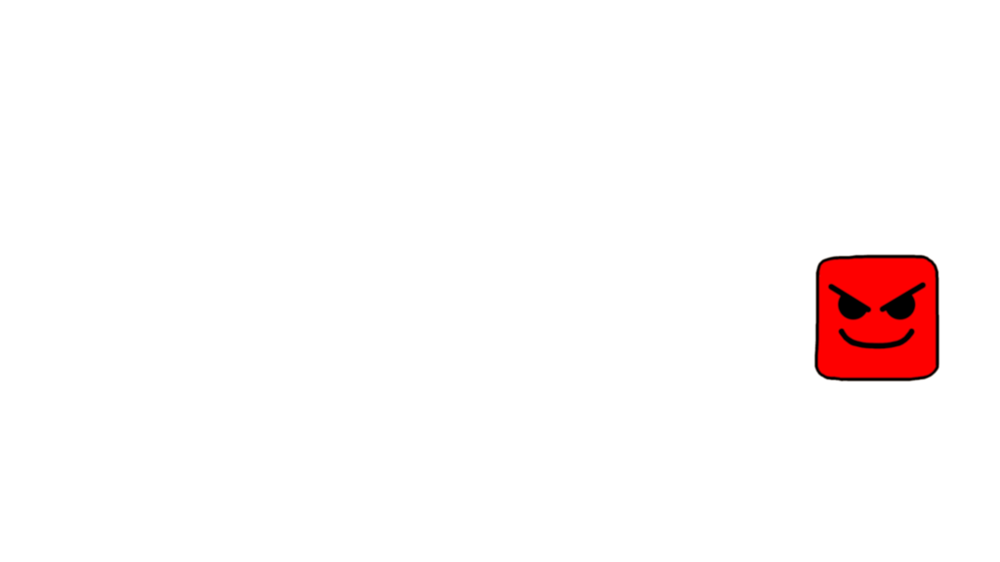
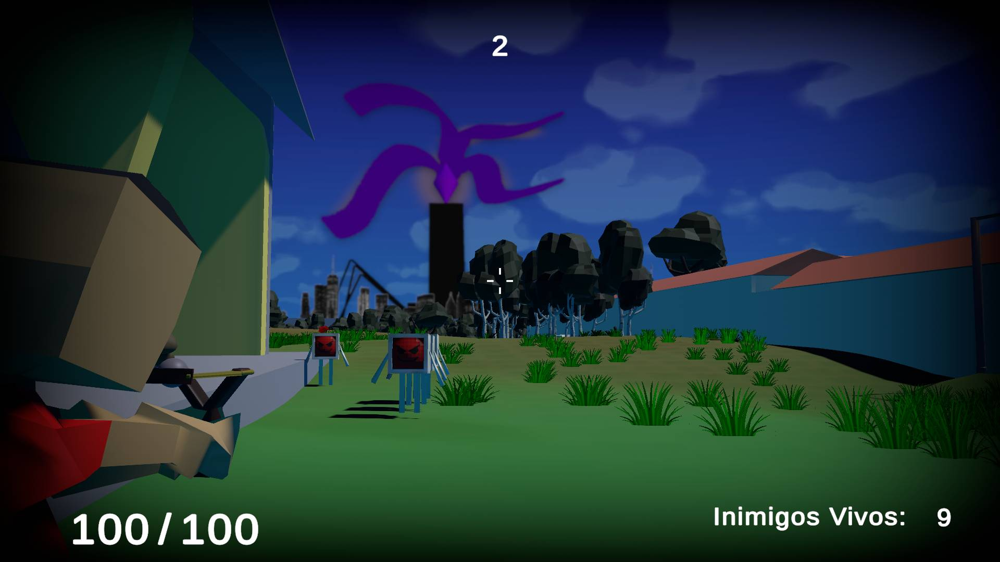

<h1>
    
    
Um jogo feito na Unity, por alunos do 2°C do CETEPI-1 de Paulo Afonso - Bahia

</h1>

## 🔴Sobre

**The Troia Attack** é um jogo desenvolvido pelos alunos da turma 2°C de Informática do CETEPI-1, durante a Feira Tecnológica da escola. Seu objetivo é despertar interesse entre os alunos e gestores, a fim de promover a visibilidade dos jogos eletrônicos no ambiente escolar.

Inspirado em "Left 4 Dead", "The Troia Attack" é um jogo simples de sobrevivência, no qual o jogador enfrenta hordas de computadores infectados por Trojans. O desafio é eliminar todas as ameaças em até 20 hordas. Além disso, o jogo apresenta um modo **Parkour** no qual os jogadores podem testar suas habilidades, evitando quedas e superando obstáculos até alcançar o fim do percurso.

## 👨‍💻Desenvolvimento

O jogo foi desenvolvido na Game Engine **Unity**, utilizando a linguagem **C#**. Também utilizamos outros softwares no desenvolvimento, como **Blender** e **GIMP**. Para o site, as tecnologias **HTML5**, **CSS3** e **JavaScript** estiveram presentes, além do framework **Bootstrap 5**.

## 💻Requisitos Mínimos Testados

- **SO:** 64-bit Windows 10
- **Processador:** Intel I3 2330M 2.20 GHz
- **Memória:** 6GB Ram
- **Placa de vídeo:** Intel HD Graphics 3000
- **DirectX:** Versão 11
- **Armazenamento:** 400 MB de espaço disponível

## 🌐Site

**Baixe já no site**

- [Site](https://brunomania123.github.io/TheTroiaAttackSite/)
- [Repositório do Site](https://github.com/BrunoMania123/TheTroiaAttackSite)